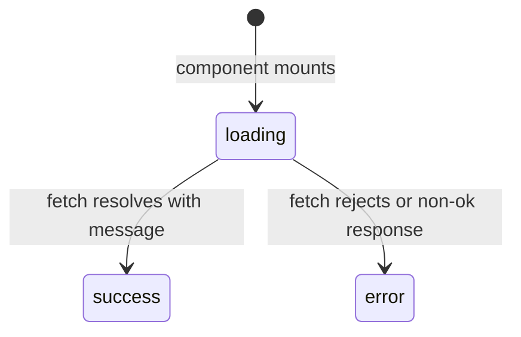

# Design Document

## Feature: fullstack-hello-world

---

## Overview

This document describes the technical design for a full-stack "Hello World" application that demonstrates a connected React frontend and FastAPI backend. The goal is a minimal, working end-to-end example: the frontend fetches a greeting from the backend and displays it.

The stack is:
- **Backend**: FastAPI (Python), served via Uvicorn, running at `http://localhost:8000`
- **Frontend**: React + Vite + Tailwind CSS, managed with pnpm, running at `http://localhost:5173`

The two services communicate over HTTP. The backend exposes a single `GET /api/hello` endpoint; the frontend calls it on load and renders the response.

---

## Architecture

```mermaid
graph LR
    subgraph Browser
        FE[React App<br/>localhost:5173]
    end
    subgraph Server
        BE[FastAPI<br/>localhost:8000]
    end
    FE -- "GET /api/hello" --> BE
    BE -- '{"message": "Hello World"}' --> FE
```

The architecture is intentionally flat — no database, no authentication, no state management library. The frontend is a single-page application that makes one HTTP request on mount. The backend is a single-file FastAPI app with one route.

**Communication flow:**
1. User opens `http://localhost:5173` in a browser.
2. React app mounts and immediately fires a `fetch` to `http://localhost:8000/api/hello`.
3. While the request is in-flight, a loading indicator is shown.
4. On success, the `message` value from the JSON response is rendered.
5. On failure, a human-readable error message is rendered.

---

## Components and Interfaces

### Backend

**File structure:**
```
/backend
├── main.py
└── requirements.txt
```

**`main.py`** — the entire backend application:
- Creates a FastAPI `app` instance.
- Configures `CORSMiddleware` to allow requests from `http://localhost:5173`.
- Defines a single route: `GET /api/hello`.

**`GET /api/hello` endpoint:**
- Method: `GET`
- Path: `/api/hello`
- Response: `200 OK`, `Content-Type: application/json`
- Response body: `{"message": "Hello World"}`
- No request parameters or body.

**`requirements.txt`:**
```
fastapi
uvicorn[standard]
```

**Run command:**
```bash
/opt/homebrew/bin/python3 -m uvicorn main:app --reload
```
(executed from the `/backend` directory)

---

### Frontend

**File structure:**
```
/frontend
├── package.json
├── pnpm-lock.yaml
├── vite.config.js (or .ts)
├── tailwind.config.js
├── postcss.config.js
├── index.html
└── src/
    ├── main.jsx
    └── App.jsx
```

**`App.jsx`** — the root component, responsible for:
- On mount (`useEffect`), fetching `http://localhost:8000/api/hello`.
- Managing three UI states: `loading`, `success` (with `message`), and `error`.
- Rendering the appropriate UI for each state.

**State machine (within `App.jsx`):**



**Props / state shape:**
```ts
// Internal state
type AppState =
  | { status: "loading" }
  | { status: "success"; message: string }
  | { status: "error"; message: string }
```

**`package.json` key dependencies:**
- `react`, `react-dom`
- `vite` (devDependency)
- `@vitejs/plugin-react` (devDependency)
- `tailwindcss`, `postcss`, `autoprefixer` (devDependencies)

---

## Data Models

### API Response

The backend returns a single, fixed JSON shape:

```json
{
  "message": "Hello World"
}
```

**FastAPI model (Pydantic):**
```python
from pydantic import BaseModel

class HelloResponse(BaseModel):
    message: str
```

Using a Pydantic model makes the response schema explicit and enables automatic OpenAPI documentation.

### Frontend Data Flow

The frontend does not persist any data. State is ephemeral and lives only in the `App` component's React state. The fetch result is mapped directly to the component's state:

| Fetch outcome | State |
|---|---|
| In-flight | `{ status: "loading" }` |
| Resolved, `ok: true` | `{ status: "success", message: data.message }` |
| Resolved, `ok: false` | `{ status: "error", message: "Failed to fetch greeting." }` |
| Rejected (network error) | `{ status: "error", message: "Network error. Is the backend running?" }` |

---

## Error Handling

### Backend

FastAPI handles malformed requests automatically (404 for unknown routes, 405 for wrong methods). The `/api/hello` endpoint has no inputs, so there are no validation errors to handle. Uvicorn will log startup errors (e.g., port already in use) to stderr.

### Frontend

All error handling is in `App.jsx`:

- **Network error** (fetch rejects): Caught in the `catch` block. Renders a message like `"Network error. Is the backend running?"`.
- **Non-2xx HTTP response** (fetch resolves but `response.ok` is false): Checked after `await fetch(...)`. Renders a message like `"Failed to fetch greeting."`.
- **Missing `message` field**: Not expected given the fixed backend response, but the component will render `undefined` gracefully (empty string). This is acceptable for a Hello World demo.

The error messages are displayed inline in the UI, replacing the loading indicator. No error boundaries are needed for this simple single-component app.

### CORS

CORS is configured on the backend to allow `http://localhost:5173`. If the frontend is served from a different origin (e.g., a different port), the browser will block the request and the frontend will show the network error state. This is by design — the README documents the expected URLs.

---

## Testing Strategy

> **Note on Property-Based Testing**: This feature is not suitable for property-based testing. The backend exposes a single fixed-response endpoint (no input variation), and the frontend is a UI rendering layer with deterministic state transitions. There is no data transformation logic or large input space that would benefit from generative testing. All tests are example-based.

### Backend Tests

Use `pytest` with `httpx` and FastAPI's `TestClient`.

**Test file:** `/backend/test_main.py`

| Test | Type | Validates |
|---|---|---|
| `GET /api/hello` returns 200 | Smoke | Req 1.1 |
| Response body equals `{"message": "Hello World"}` | Example | Req 1.2 |
| CORS header present for allowed origin | Smoke | Req 1.3 |
| CORS header absent for disallowed origin | Example | Req 1.3 |

**Example test:**
```python
from fastapi.testclient import TestClient
from main import app

client = TestClient(app)

def test_hello_returns_correct_message():
    response = client.get("/api/hello")
    assert response.status_code == 200
    assert response.json() == {"message": "Hello World"}

def test_cors_allowed_origin():
    response = client.options(
        "/api/hello",
        headers={"Origin": "http://localhost:5173", "Access-Control-Request-Method": "GET"}
    )
    assert "access-control-allow-origin" in response.headers
```

### Frontend Tests

Use Vitest with React Testing Library.

**Test file:** `/frontend/src/App.test.jsx`

| Test | Type | Validates |
|---|---|---|
| Fetch is called with correct URL on mount | Example | Req 2.4 |
| Message is displayed after successful fetch | Example | Req 2.5 |
| Loading indicator shown while fetch is pending | Example | Req 2.6 |
| Error message shown when fetch fails | Example | Req 2.7 |

**Example test:**
```jsx
import { render, screen, waitFor } from '@testing-library/react'
import { vi } from 'vitest'
import App from './App'

test('displays message from API', async () => {
  global.fetch = vi.fn().mockResolvedValue({
    ok: true,
    json: async () => ({ message: 'Hello World' }),
  })
  render(<App />)
  expect(screen.getByText(/loading/i)).toBeInTheDocument()
  await waitFor(() => screen.getByText('Hello World'))
})

test('displays error when fetch fails', async () => {
  global.fetch = vi.fn().mockRejectedValue(new Error('Network error'))
  render(<App />)
  await waitFor(() => screen.getByText(/network error/i))
})
```

### Running Tests

```bash
# Backend
cd backend
/opt/homebrew/bin/python3 -m pytest

# Frontend
cd frontend
pnpm test --run
```
